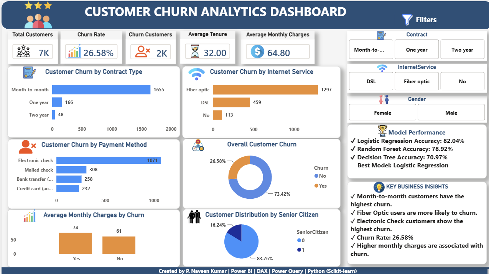
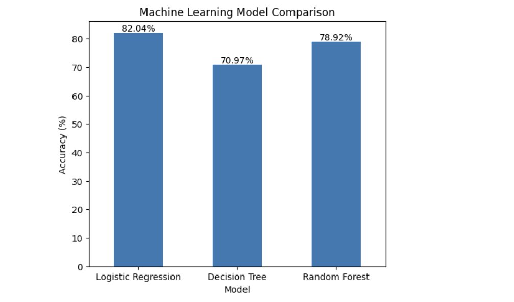
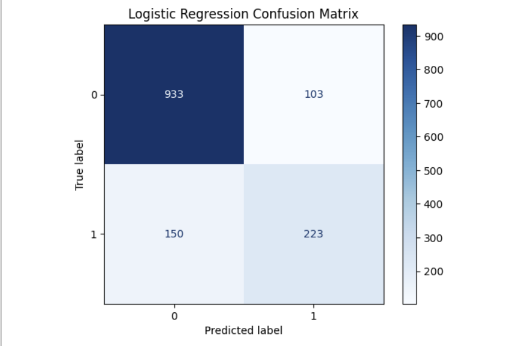

# 📊 Customer Churn Prediction Analysis

An end-to-end Customer Churn Prediction project combining **Machine Learning** and **Business Intelligence** to identify customers likely to churn and provide actionable business insights through an interactive Power BI dashboard.

---

## 🚀 Project Overview

Customer churn is a major challenge for subscription-based businesses. This project analyzes telecom customer data, builds predictive machine learning models, and visualizes customer behavior using Power BI.

---

## 🎯 Objectives

- Predict customer churn using Machine Learning.
- Compare multiple classification models.
- Build an interactive Power BI dashboard.
- Generate business insights for customer retention.

---

## 🛠️ Technologies Used

- Python
- Pandas
- NumPy
- Scikit-learn
- Matplotlib
- Power BI
- Power Query
- DAX
- Jupyter Notebook

---

## 📂 Dataset

- **Dataset:** Telco Customer Churn Dataset
- **Customers:** 7,043
- **Target Variable:** Churn (Yes/No)

---

## 🔄 Project Workflow

```text
Data Collection
      ↓
Data Cleaning & Preprocessing
      ↓
Exploratory Data Analysis (EDA)
      ↓
Feature Engineering
      ↓
Machine Learning Models
      ↓
Model Evaluation
      ↓
Power BI Dashboard
```

---

## 🤖 Machine Learning Models

| Model | Accuracy |
|-------|----------|
| Logistic Regression | **82.04%** |
| Random Forest | **78.92%** |
| Decision Tree | **70.97%** |

🏆 **Best Performing Model:** Logistic Regression

---

## 📊 Power BI Dashboard

The dashboard includes:

- KPI Cards
- Churn Rate Analysis
- Contract Type Analysis
- Internet Service Analysis
- Payment Method Analysis
- Senior Citizen Analysis
- Interactive Filters
- Business Insights
- Model Performance Summary

---

## 📈 Dashboard Preview



---

## 📉 Machine Learning Model Comparison



---

## 📊 Confusion Matrix



---

## 💡 Key Business Insights

- Month-to-Month contract customers have the highest churn.
- Fiber Optic customers are more likely to churn.
- Electronic Check customers show the highest churn.
- Overall churn rate is **26.58%**.
- Logistic Regression achieved the highest prediction accuracy (**82.04%**).

---

## 📌 Future Improvements

- Hyperparameter tuning
- Cross-validation
- Model deployment using Streamlit or Flask
- Real-time dashboard integration

---

## 👨‍💻 Author

**P. Naveen Kumar**

MBA – Business Analytics

Power BI | SQL | Python | Machine Learning
